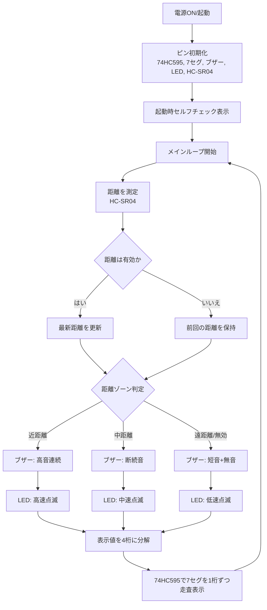

# 発表用フローチャート

このフローチャートは、接近感知ガジェットの動作を発表で説明するためのものです。

```mermaid
flowchart TD
    A[電源ON/起動] --> B[ピン初期化
74HC595, 7セグ, ブザー, LED, HC-SR04]
    B --> C[起動時セルフチェック表示]
    C --> D[メインループ開始]

    D --> E[距離を測定
HC-SR04]
    E --> F{距離は有効か}
    F -- はい --> G[最新距離を更新]
    F -- いいえ --> H[前回の距離を保持]

    G --> I{距離ゾーン判定}
    H --> I

    I -- 近距離 --> J[ブザー: 高音連続]
    I -- 中距離 --> K[ブザー: 断続音]
    I -- 遠距離/無効 --> L[ブザー: 短音+無音]

    J --> M[LED: 高速点滅]
    K --> N[LED: 中速点滅]
    L --> O[LED: 低速点滅]

    M --> P[表示値を4桁に分解]
    N --> P
    O --> P

    P --> Q[74HC595で7セグを1桁ずつ走査表示]
    Q --> D
```

## 発表用の一言

- 距離を測る
- 危険度を判定する
- 音と光と表示で同時に知らせる

この3点を軸に説明すると、短時間でも伝わりやすくなります。
